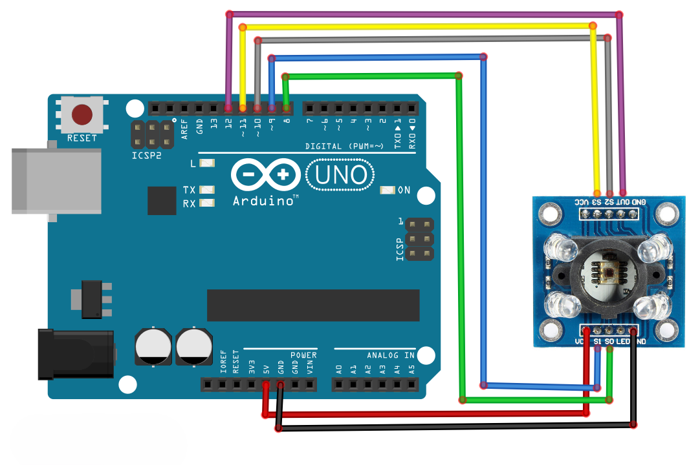
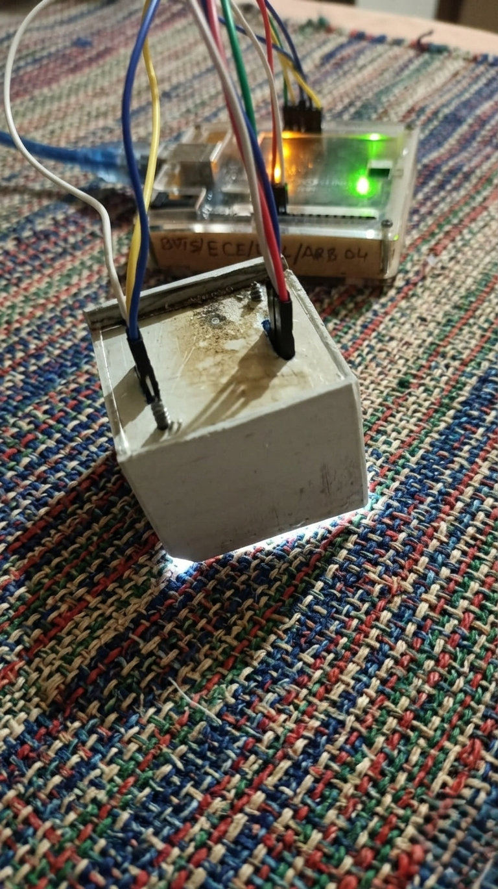
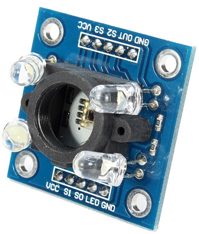
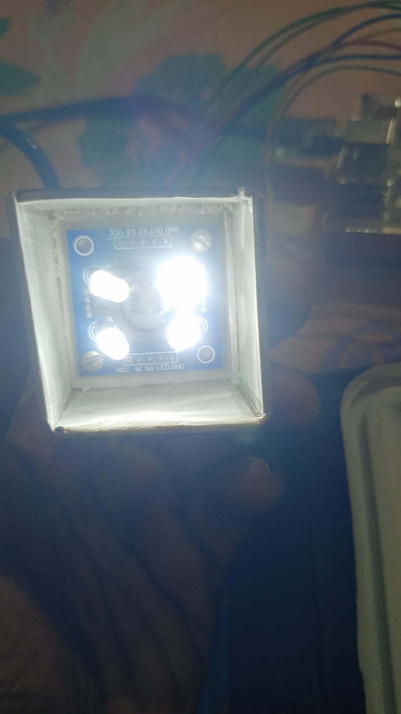
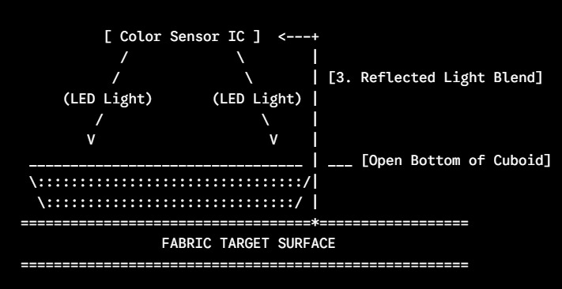

# Fabric Colour Identifier using TCS3200 Sensor

## Overview

This project implements a Fabric Colour Identification System using the TCS3200 colour sensor and Arduino UNO. The system captures RGB frequency values from fabric samples and compares them against a predefined CSV dataset containing known colour values.

The detected RGB values are matched with the closest RGB combination available in the dataset to identify the corresponding fabric colour.

A custom sensor enclosure with controlled LED illumination was designed to improve sensing accuracy by reducing external light interference during colour detection.

---

## Features

- Real-time fabric colour detection
- RGB frequency analysis using TCS3200
- CSV dataset-based colour identification
- Closest RGB colour matching logic
- Controlled LED illumination for better accuracy
- Custom sensor arrangement
- Serial monitor output display
- Embedded low-cost sensing solution

---

## Components Used

| Component | Quantity |
|---|---|
| Arduino UNO | 1 |
| TCS3200 Colour Sensor | 1 |
| Jumper Wires | Several |
| Breadboard | 1 |
| Fabric Samples | Multiple |
| USB Cable | 1 |

---

## Working Principle

The TCS3200 sensor detects the intensity of red, green, and blue light reflected from the fabric surface.

The Arduino reads the RGB frequency values and processes them through embedded logic. These values are then compared with predefined RGB values stored in a CSV dataset.

The system searches for the closest matching RGB combination and identifies the corresponding fabric colour from the dataset.

The onboard LEDs of the TCS3200 sensor provide controlled illumination, which improves colour sensing consistency and minimizes the impact of external lighting conditions.

---

## Dataset-Based Colour Matching

A CSV dataset containing predefined RGB colour values was used for colour identification.

### Example Dataset Structure

| Red | Green | Blue | Colour Name |
|---|---|---|---|
| 255 | 0 | 0 | Red |
| 0 | 255 | 0 | Green |
| 0 | 0 | 255 | Blue |
| 255 | 255 | 0 | Yellow |

The detected RGB values from the sensor are compared with the dataset to determine the nearest matching colour.

This approach improves scalability and enables support for a larger number of fabric colour samples.

---

## Pin Connections

| TCS3200 | Arduino UNO |
|---|---|
| VCC | 5V |
| GND | GND |
| S0 | D4 |
| S1 | D5 |
| S2 | D6 |
| S3 | D7 |
| OUT | D8 |
| LED | 5V |

---

## Circuit Diagram



---

## Setup Images

### Complete Hardware Setup



### TCS3200 Sensor Close-up



### Sensor Mount Arrangement



### LED Illumination Testing



---

## Custom Sensor Arrangement

A custom enclosure was designed around the TCS3200 sensor to reduce external light interference and improve colour detection accuracy during fabric analysis.

The arrangement also helps maintain a fixed sensing distance between the sensor and fabric surface for reliable RGB measurements.

---

## Output Example

Detected Colour: BLUE

RGB Values:
R = 45
G = 110
B = 130

Closest Match Found:
Colour Name = Navy Blue

---

## Applications

- Textile industry automation
- Fabric colour inspection
- Smart sorting systems
- Industrial quality control
- Embedded sensing applications
- Colour-based classification systems

---

## Future Scope

- Advanced colour matching algorithms
- Machine learning-based colour classification
- Mobile application integration
- Cloud-based colour database
- Industrial textile quality inspection
- Real-time colour similarity percentage
- AI-assisted fabric colour recommendation system
- IoT-based remote monitoring

---

## Technologies Used

- Embedded C
- Arduino IDE
- Sensor Interfacing
- RGB Colour Detection
- CSV Data Processing
- Dataset-Based Classification
- Serial Communication

---

## Technical Concepts Used

- Embedded Systems
- Sensor Interfacing
- RGB Colour Detection
- Serial Communication
- Dataset-Based Classification
- CSV Data Processing
- Arduino Development

---

## Repository Structure

```text
fabric-colour-identifier-tcs3200/
│
├── README.md
├── code/
│   └── fabric_colour_identifier.ino
│
├── setup/
│   ├── setup.jpg
│   ├── tcs3200-closeup.jpg
│   ├── sensor-mount.jpg
│   └── led-illumination.jpg
│
├── circuit-diagram/
│   └── circuit-diagram.png
│
└── csv-file/
    └── colours.csv
```

---

## Author

Pilla Naga Adinarayana

ECE Graduate | Embedded Systems Enthusiast | IoT & Firmware Projects
